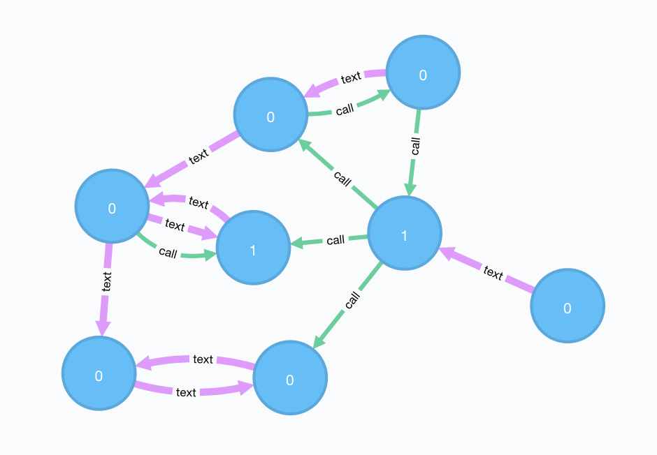

# graph playground
Showing how easy to find interesting connections in graphs and how people often are defined over the social network they live in.

Starting out with neo4j (for small graphs) I subsequently will explore big data technologies (spark, flink) to address graph analytics at scale.

## problem description
There is a graph of a social network of people communicating with each other either via phone call or per text message. Some of the people are terrorists. I want to find out how close the other people are to the terrorists i.e. if the data suggests that there might be an additional hidden terrorist.



**queries**
Starting out simple calculating the fraudulence for each user in the network and ignoring the type of connection or directedness I want to include not only the direct connections but consider the network up to 3 levels deep into the graph, directedness of edges and type of edges and return the following values as a table:

```
Vertex | FraudulenceNetwork | OwnFraudulence | type_Fraudulence
1      | someValue i.e. 0.8.|       1        | undirected_1_level_no_type_of_connection
...
```

## answering the queries
look into the subfolders.

### neo4j
See the folder [neo4j](neo4j) for details.
In general, it works very well, but manually creating the statements can be error prone. Therefore python can be used to chain together the different queries.

### spark
Multiple possibilities exist to use spark with graphs.
Spark [graph-frames](https://graphframes.github.io) is the go to package for graphs on spark, however, one might face issues with bigger https://stackoverflow.com/questions/41351802/partitioning-with-spark-graphframes as finding an optimal partitioning strategy is hard. Also, naive joins will be used when traversing the graph!
Additionaly, the cypher patterns supported are fairly limited.

Recently, https://github.com/opencypher/cypher-for-apache-spark was released. More cypher features are supported, but it is still at an alpha stage as of 2017-12-03.

A graph storage engine like neo4j and spark can be connected by https://github.com/neo4j-contrib/neo4j-spark-connector. It is possible to have spark workers and the graph database share their respective own jvm instance.

Also, https://github.com/neo4j-contrib/neo4j-mazerunner can export the data to CSV where it then can be processed in the hadoop world and is considered a very stable approach.


### flink
In general, graphs seem to feel more at home with flink. Recently, https://github.com/dbs-leipzig/gradoop was introduced to enable cypher support. The downside is, that scala is not supported properly.